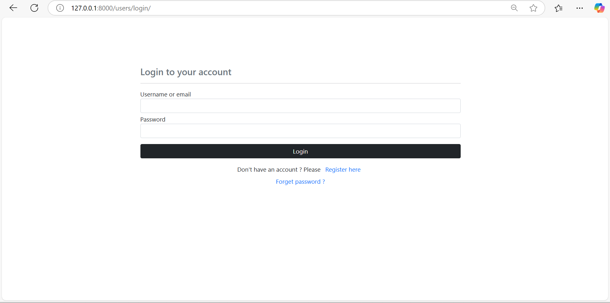
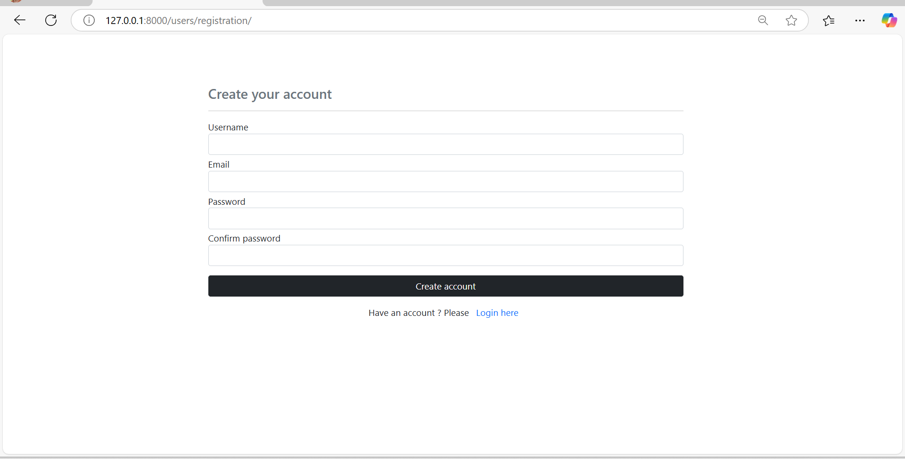
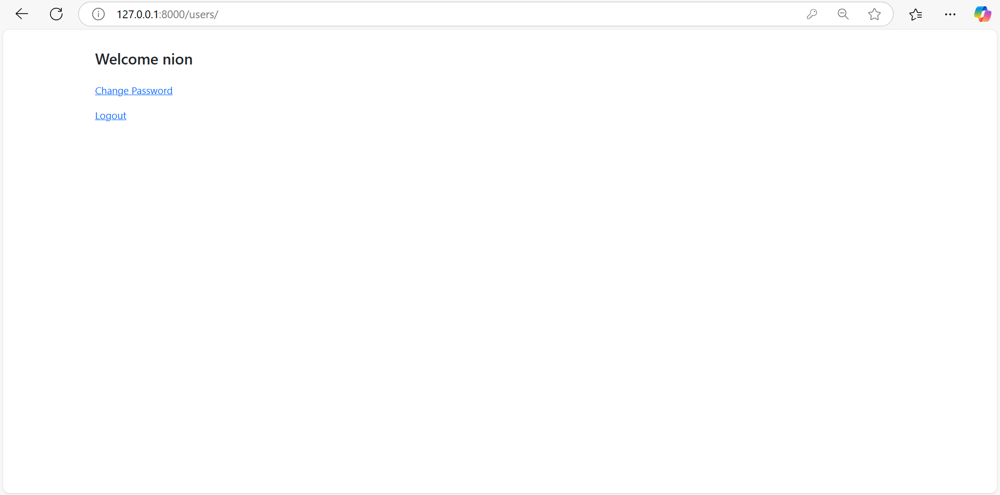
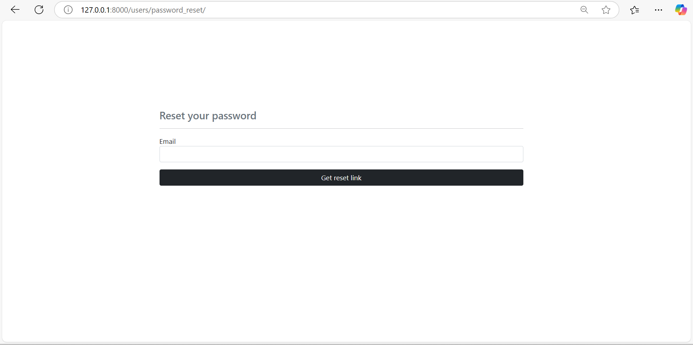

# Django Authentication System

This project is a Django-based authentication system that includes user registration, login, and password management functionalities.

## Features
- User registration
- User login/logout
- Password change/reset
- Secure authentication system

## Screenshots

### Login Page


### Registration Page


### User Dashboard


### Password Reset Page


## Installation

1. Clone the repository:
   ```sh
   git clone https://github.com/CoderMahruf/authentication.git
   ```

2. Create a virtual environment and activate it:
   ```sh
   python -m venv env
   source venv/bin/activate
   ```

3. Install dependencies:
   ```sh
   pip install -r requirements.txt
   ```

4. Apply migrations:
   ```sh
   python manage.py migrate
   ```

5. Run the development server:
   ```sh
   python manage.py runserver
   ```

6. Open your browser and go to `http://127.0.0.1:8000/users/login/` to access the login page.

## Usage
- New users can register on the registration page.
- Registered users can log in and access their dashboard.
- Users can change their passwords from the dashboard.

## Technologies Used
- Django
- Python
- HTML/CSS

## License
This project is licensed under the MIT License.

## Author
[Mahruful Alam](https://github.com/CoderMahruf)

